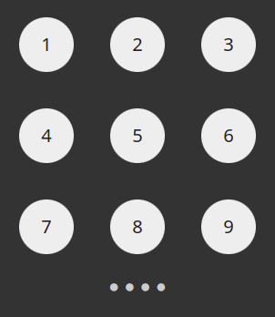

# PIN

Create a PIN code page using React and Styled components. Refer to the demo image below.

- Use at least three components made with Styled components: `PinCode`, `Button` and `Circle`.

Avoid all CSS if you can (but if you want to, you can remove the body margin with a CSS file).

**BONUS** Make the buttons work. When the user clicks a button, change one of the circles to green. After the user has pressed four numbers, check if they match "1972" - if they do, show `alert("Access granted")` and if not... well, you decide ;)